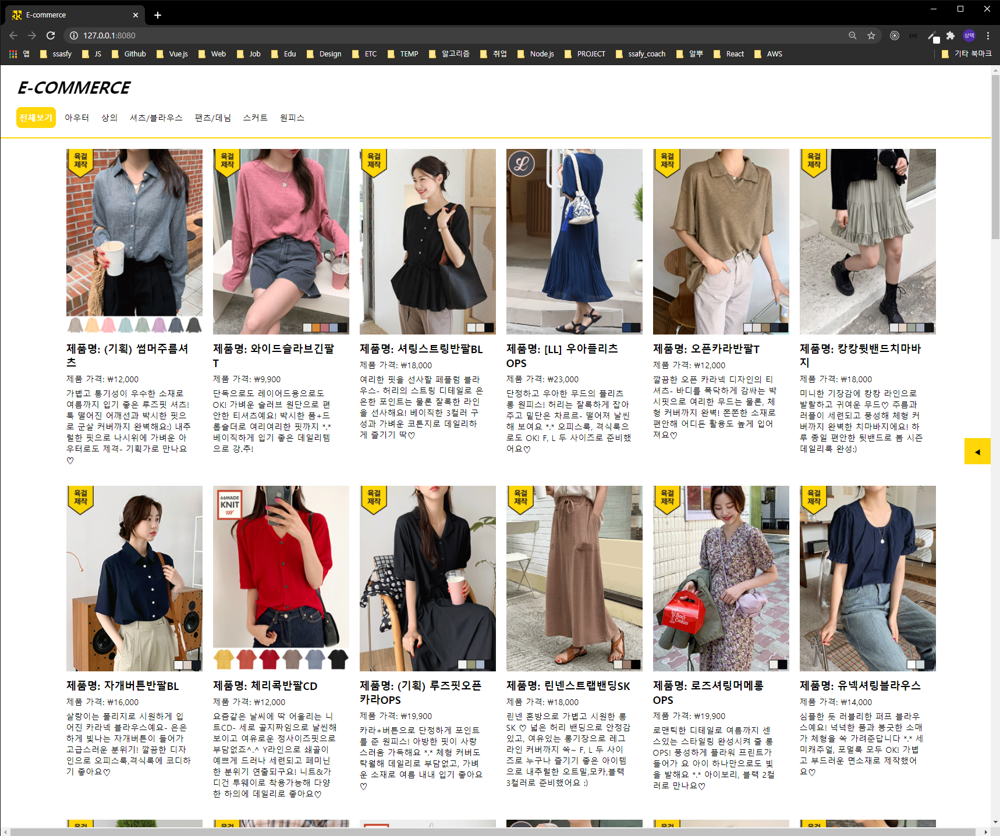
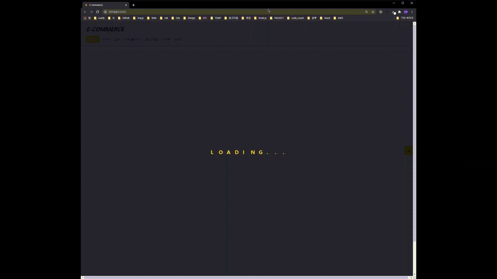
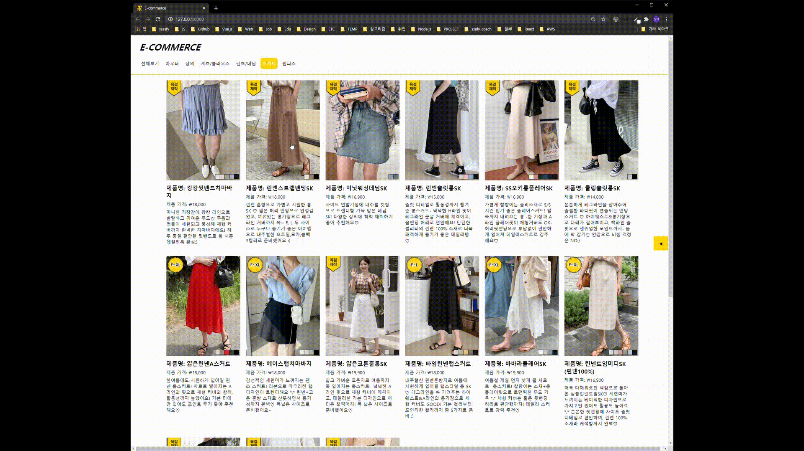

# E-commerce with vanillaJS

vanillaJS를 이용하여 온라인 쇼핑몰 사이트를 간단하게 만드는 프로젝트입니다. 

 

# Installation

``npm install && npm run start``

 

# Data

``https://66girls.co.kr`` 를 크롤링하여 firestore에 저장해서 사용했습니다.

 

# Project

``FE``: vanilaJS + live-server

``BE``: firebase (serverless)

 

# Version

`2020-09-10` : 리팩토링 및 카테고리 선택 시 딜레이 기능 추가 

 

# Summary

## Loading

css3 `transform`의 ``translate`` 속성을 이용하여 로딩 화면을 구현했습니다.

> 위치: `src/components/Loading.js`

 

 

## Category List & Product List

카테고리를 클릭하면 ``api``를 통해 데이터를 받아온 후, 이를 리스트 영역에 보여줍니다. 이미지의 경우 ``lazy-load``를 적용하여 화면상에 이미지가 보여졌을 때부터 이미지를 렌더링합니다. 또한 ``반응형 웹``을 적용하여 디바이스의 가로 길이에 맞게 한 줄에 보여지는 product 카드의 갯수가 변경됩니다.

> 위치: ``src/components/CategoryList.js``, ``src/components/ProductList.js``

 

 

## Detail page with Modal

product 카드를 클릭하면 모달을 통해 디테일 페이지를 보여줍니다. 모달의 경우 사용자가 `esc버튼`을 누르거나 우측 상단에 위치한 `x 버튼` 또는 `모달 밖의 검정 영역`을 클릭할 경우 닫힙니다.

> 위치: `src/components/ProductInfo.js`

 

 

## Sidebar

우측에 사이드바를 클릭하면 사이드바 영역이 보여집니다. 최대 3개까지 최근 본 상품이 기록되며 최근 상품을 클릭하면 해당 상품의 정보가 모달을 통해 보여집니다. 

> 위치: `src/components/Sidebar.js`